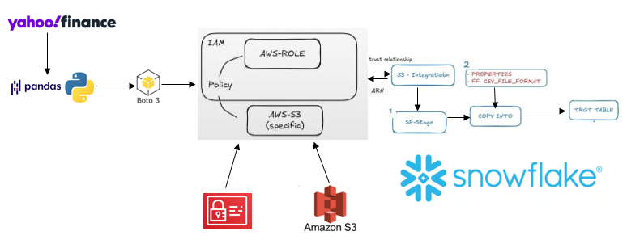

# Project: Stock Data Pipeline using Python, AWS & Snowflake

- This project was built as part of the Saylani Zaitoon Ashraf Cloud Data Engineering course.

# 🚀 Overview

- The goal of this project is to build a data pipeline that collects stock data from Yahoo Finance processes it, stores it in AWS S3, and then loads it into Snowflake for further use.

# 🛠️ Tools & Technologies Used

- Python (yfinance, pandas, boto3)
- AWS (S3, IAM)
- Snowflake (S3 Integration, Staging, COPY INTO)

# 📈 What the Project Does

- Collects stock market data using yfinance
- Cleans and transforms the data with pandas
- Uploads the processed CSV file to Amazon S3 using boto3
- Creates a custom IAM Role and Policy for secure access
- Sets up S3 integration with Snowflake
- Loads the data into Snowflake using COPY INTO